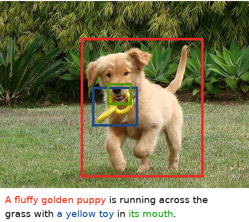
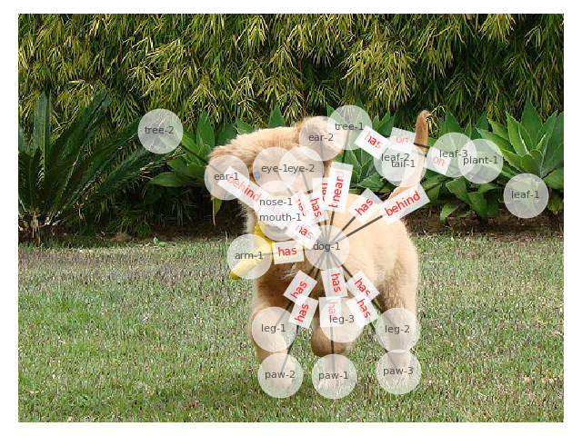
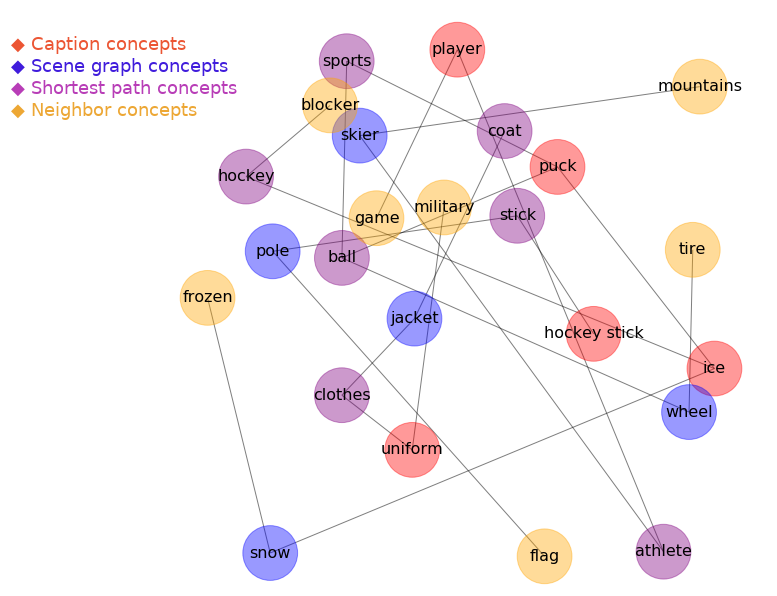

# Employing the Scene Graph for Phrase Grounding

This is the repo for my Master thesis about *Employing the Scene Graph for Phrase Grounding*, submitted in September 2020 at the University of Heidelberg.

### Task

**Phrase grounding** or phrase localization describes the task of aligning phrases in the caption with the corresponding region of
the image. A phrase is defined as a segment of a caption (usually a noun phrase) that describes one specific object or area in the image. Regions are usually marked by bounding boxes enclosing the object in question. The figure below gives an example for phrase grounding: the phrases *a fluffy golden puppy*, *a yellow toy* and *its mouth* have to be aligned to their corresponding (same color) bounding boxes in the image.

The **scene graph** [Johnson et al., 2015] represents an image as a graph with detected objects as nodes and their relations as edges. It puts the objects of a scene in context with each other. The figure below shows the scene graph for the example picture overlaid on the image. It has proven to be a meaningful image presentation when solving phrase grounding and we use it as a basis for our system. 

### Scene Graph and Aligner Enhancements

Unfortunately, the scene graph is not yet perfect so we enhanced it by:

- Adding plural entities
- Eliminating superfluous entities
- Adding color attribute
- Adding information about location of entities (foreground/background)

Furthermore, we adjusted the aligner so it can make use of this new information. This gives us an **increase of 6%** in accuracy when evaluating on the Flickr30k dataset.

### ConceptNet Extensions

We constructed a subgraph from ConceptNet for each image and caption pair in order to inject external knowledge into our alignments. You can see an example subgraph below. From these subgraphs, we extracted new similarity measures for matching the phrases and scene graph objects using the path length and personalized PageRank. We achieved results comparable to those computed for the alignment by word embeddings similarity. 

### Further descriptions and instructions for using the code

... will follow once the paper is published (April 2021).